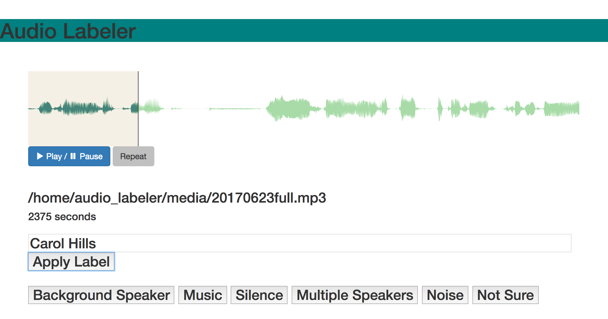

## Audio Labeler

[<< Back to pg. 1](https://github.com/hipstas/aapb-july-2017-demo/blob/master/README.md) \| [Forward to pg. 3 >>](https://github.com/hipstas/aapb-july-2017-demo/blob/master/03_attk.utils_demo.ipynb)

[> Live Demo Here <](http://138.68.247.106:8000/)




### Installing Audio Labeler on macOS

Download Docker image and run it in detached mode.

```
docker pull hipstas/audio-labeler

docker run -it -d --name audio_labeler -p 8000:8000 -v ~/Desktop/audio_labeler:/home/audio_labeler hipstas/audio-labeler bash
```

Start a terminal session in your running Docker container.

```
docker exec -ti audio_labeler /bin/bash
```


Now `cd` into the newly created `media` directory and download some audio with `wget`.

```
cd /home/audio_labeler/media/

wget -i https://raw.githubusercontent.com/hipstas/aapb-july-2017-demo/master/sample_audio_urls.txt
```

Open a new terminal window in your local system and enter the following three commands to restart the Docker container.

```
docker rm -f audio_labeler
docker pull hipstas/audio-labeler
docker run -it --name audio_labeler -d -p 8000:8000 -v ~/Desktop/audio_labeler:/home/audio_labeler hipstas/audio-labeler bash
```

Point your browser to localhost:8000 and begin labeling. The application will output all labels to the file `~/Desktop/audio_labeler/output_table.csv`.


### Installing Audio Labeler on a GNU/Linux VPS

Download Docker image and run it in detached mode.

```
docker pull hipstas/audio-labeler
docker run -it -d --name audio_labeler -p 8000:8000 -v /home/audio_labeler:/home/audio_labeler hipstas/audio-labeler bash
```

Now `cd` into a newly created directory and download some audio with `wget`.

```
cd /home/audio_labeler/media/

wget -i https://raw.githubusercontent.com/hipstas/aapb-july-2017-demo/master/sample_audio_urls.txt
```

Restart the docker container to start labeling your audio.

```
docker rm -f audio_labeler
docker pull hipstas/audio-labeler
docker run -it -d --name audio_labeler -p 8000:8000 -v /home/audio_labeler:/home/audio_labeler hipstas/audio-labeler bash
```

Point your browser to `*[vps ip address here]*:8000` and begin labeling.

The application will output all labels to the file `/home/audio_labeler/output_table.csv`.

Or enter this URL to download the file
`*[vps ip address here]*:8000/static/output/output_table.csv`


[> Live Demo Here <](http://138.68.247.106:8000/)

[> Live Demo CSV Download <](http://138.68.247.106:8000/static/output/output_table.csv)
